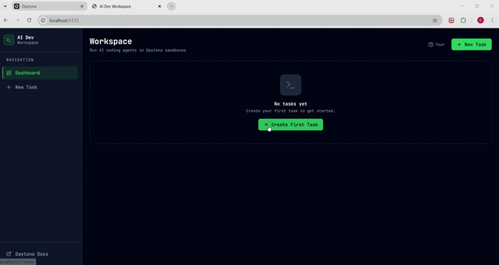

# Build AI Coding Agents with Daytona

> An AI-powered coding agent platform where natural language tasks are executed autonomously inside isolated Daytona sandboxes — with live logs, web previews, and full run history.


---

## What is This?

This project is a full-stack AI agent execution platform. You submit a coding task in plain English — *"build me a portfolio website"*, *"add a dark mode toggle to this repo"*, *"fix the bug in this Python script"* — and an AI agent picks it up, plans the work, runs code inside an isolated cloud sandbox, and streams the results back to your browser in real time.

**The execution engine: Daytona.** Every agent run happens inside a Daytona sandbox — a secure, ephemeral Linux environment the agent can freely operate in, without touching your local machine or anyone else's.

---

## What Can Daytona Do?

Daytona is **secure and elastic infrastructure for running AI-generated code**. It is built around the concept of a *sandbox* — an on-demand, fully isolated cloud environment you can spin up, use, and destroy entirely through an API or SDK.

Here is the full picture of what Daytona provides:

### Sandbox Lifecycle
Provision, start, stop, resize, archive, and delete isolated Linux environments on demand — all via API. Each sandbox is fully isolated: separate filesystem, separate process tree, separate network namespace.

```python
from daytona import Daytona, CreateSandboxParams

daytona = Daytona()
sandbox = daytona.create(CreateSandboxParams(language="python"))
sandbox.stop()
sandbox.start()
sandbox.delete()
```

### Process & Command Execution
Run arbitrary shell commands and capture output. Go deeper with persistent sessions (stateful shell), PTY (interactive terminal), and streaming logs.

```python
result = sandbox.process.exec("python -m pytest tests/ -v")
print(result.output)

# Stateful session — commands share shell context
session = sandbox.process.create_session("my-shell")
sandbox.process.exec_session(session.id, "cd /app && export ENV=prod")
sandbox.process.exec_session(session.id, "python main.py")  # ENV is still set
```

### File System
Full file management: upload, download, list, create, delete, move, find, search content, replace text, set permissions — all programmatically.

```python
sandbox.fs.upload_file("/app/main.py", open("main.py", "rb").read())
content = sandbox.fs.download_file("/app/output.txt")
sandbox.fs.replace_in_files("/app", "old_function", "new_function")
```

### Git Operations
Clone repositories, create branches, commit and push changes — native Git support without needing to shell out.

```python
sandbox.git.clone("https://github.com/user/repo.git", "/app/repo")
sandbox.git.create_branch("/app/repo", "feature/my-change")
sandbox.git.add("/app/repo", ["."])
sandbox.git.commit("/app/repo", "feat: add new feature", "Bot", "bot@example.com")
sandbox.git.push("/app/repo")
```

### Public Preview URLs
Expose any port running inside the sandbox as a public HTTPS URL instantly — no tunnels, no ngrok, no extra config.

```python
preview = sandbox.get_preview_link(port=3000)
print(preview.url)  # https://xyz.sandbox.daytona.io
```

Supports signed preview links with expiry for access control.

### Templates & Custom Snapshots
Start from pre-built templates (`ubuntu-22`, `python-3.11`, `node-20`) or your own custom snapshots — for near-instant startup with dependencies pre-installed.

```python
sandbox = daytona.create(CreateSandboxParams(snapshot="my-prebuilt-env"))
```

### Declarative Image Builder
Build custom Docker images programmatically — specify base image, run apt-get or pip install, set env vars, copy files — without writing a Dockerfile.

```python
image = (
    daytona.image.base("ubuntu:22.04")
    .apt_get(["python3", "git", "curl"])
    .pip_install(["fastapi", "langchain"])
    .env({"APP_ENV": "production"})
    .run("mkdir -p /app")
)
sandbox = daytona.create(CreateSandboxParams(image=image))
```

### Volumes (Persistent Storage)
Mount shared volumes across multiple sandboxes — useful for sharing datasets, caches, or build artifacts between runs.

### Computer Use
Full desktop automation inside the sandbox: mouse clicks, keyboard input, screenshots, screen recording. Build agents that can interact with GUIs.

```python
sandbox.computer_use.start()
sandbox.computer_use.mouse.click(x=100, y=200)
sandbox.computer_use.keyboard.type("Hello world")
screenshot = sandbox.computer_use.screenshot.take()
```

### LSP (Language Server Protocol)
Start a language server inside the sandbox and query code completions, document symbols, and workspace-wide symbol search — exactly what a code-aware AI agent needs.

```python
lsp = sandbox.lsp_server.start("python", "/app")
completions = lsp.completions("/app/main.py", line=10, col=5)
symbols = lsp.workspace_symbols("MyClass")
```

### Lifecycle Management
Set auto-archive and auto-delete intervals so resources clean themselves up without manual intervention.

```python
sandbox.set_auto_delete_interval(minutes=30)
sandbox.set_auto_archive_interval(hours=2)
```

### Observability
Built-in OpenTelemetry tracing, audit logs, per-sandbox resource usage, and a billing dashboard — everything you need to operate sandboxes in production.

### Multi-SDK, Multi-Region
Official SDKs for **Python**, **TypeScript/JavaScript**, and **Go**. Deploy sandboxes in **US** or **EU** regions.

---

## How This Project Uses Daytona

This project does not use every Daytona feature — it is focused on code execution and web previews. Here is exactly which Daytona capabilities are active in this codebase and why each one matters:

### Used in This Project

| Daytona Feature | Where | What it enables |
|---|---|---|
| **Sandbox creation** | `DaytonaManager.create_sandbox()` | Fresh isolated environment per task — no state leakage between runs |
| **Template selection** | `CreateSandboxParams(snapshot=...)` | User picks the right OS/runtime for their task (`ubuntu-22`, `python-3.11`, `node-20`) |
| **Command execution** | `exec_command` tool → `sandbox.process.exec()` | The agent runs shell commands: `npm install`, `python main.py`, `git clone`, etc. |
| **File upload** | `write_file` tool → `sandbox.fs.upload_file()` | Agent writes code files into the sandbox |
| **File download** | `read_file` tool → `sandbox.fs.download_file()` | Agent reads files back to inspect or compare output |
| **Directory listing** | `list_files` tool → `sandbox.fs.list_files()` | Agent explores the project structure before making changes |
| **Git clone** | `git_clone` tool → `sandbox.git.clone()` | Agent clones a user-provided repo to work on existing code |
| **Public preview URL** | `DaytonaManager.get_preview_url()` | After agent starts a web server, user gets a live clickable link to the running app |
| **Sandbox deletion** | `DaytonaManager.delete_sandbox()` | Clean up cloud resources when a task is deleted |

### What This Project Does NOT Use (Yet)

These Daytona features exist and could extend this project:

| Feature | Potential Use |
|---|---|
| **Stateful sessions** | Let the agent maintain shell state (`cd`, `export`) across tool calls — currently each `exec_command` is stateless |
| **LSP server** | Give the agent language-aware code completions and symbol lookup |
| **Computer Use** | Agents that can interact with GUI apps inside the sandbox |
| **Volumes** | Share a common package cache across task sandboxes to speed up `npm install` / `pip install` |
| **Custom snapshots** | Pre-baked environments with all common tools already installed — faster cold start |
| **Signed preview URLs** | Secure previews with expiry for multi-tenant deployments |
| **OpenTelemetry** | Trace every sandbox operation for debugging slow agent runs |

---

## Architecture

```
┌─────────────────────────────────────────────────────────────────────┐
│                          User's Browser                              │
│                                                                      │
│   ┌──────────────┐    ┌──────────────┐    ┌──────────────────────┐  │
│   │  Dashboard   │    │  New Task    │    │   Run Detail         │  │
│   │  (task list) │    │  (form)      │    │  (logs + preview)    │  │
│   └──────┬───────┘    └──────┬───────┘    └──────────┬───────────┘  │
│          │                   │                        │              │
│          └───────────────────┴────────────────────────┘              │
│                  React 18 + TypeScript + Tailwind CSS                │
└─────────────────────────┬───────────────────────┬────────────────────┘
                          │  REST API             │  WebSocket
                          │  /api/tasks           │  /ws/runs/{id}/logs
                          ▼                       ▼
┌─────────────────────────────────────────────────────────────────────┐
│                        FastAPI Backend (Python 3.11)                 │
│                                                                      │
│  ┌─────────────────────────────────────────────────────────────┐    │
│  │                       API Layer                             │    │
│  │   POST /api/tasks  ──► create task + fire agent run         │    │
│  │   GET  /api/tasks  ──► list with status                     │    │
│  │   POST /runs/{id}/retry ──► re-run failed task              │    │
│  └───────────────────────────┬─────────────────────────────────┘    │
│                              │                                       │
│  ┌───────────────────────────▼─────────────────────────────────┐    │
│  │               LangGraph Agent Pipeline                      │    │
│  │                                                             │    │
│  │  [Intake] ──► [Plan] ──► [Execute] ──► [Evaluate]          │    │
│  │                              ▲              │               │    │
│  │                              └── retry ─────┘               │    │
│  │                                             │ success        │    │
│  │                                        [Finalize]           │    │
│  │                                    (summary + diff patch)   │    │
│  └───────────────────────────┬─────────────────────────────────┘    │
│                              │  5 LangChain tools                   │
│  ┌───────────────────────────▼─────────────────────────────────┐    │
│  │                   DaytonaManager                            │    │
│  │                                                             │    │
│  │  exec_command  │  read_file   │  write_file                 │    │
│  │  list_files    │  git_clone   │  get_preview_url            │    │
│  └───────────────────────────┬─────────────────────────────────┘    │
│                              │                                       │
│  ┌───────────────────────────▼─────────────────────────────────┐    │
│  │       SQLite + SQLAlchemy (async)                           │    │
│  │       Tasks → Runs → Logs  (streamed via WebSocket)         │    │
│  └─────────────────────────────────────────────────────────────┘    │
└──────────────────────────────┬──────────────────────────────────────┘
                               │  Daytona Python SDK (HTTPS)
                               ▼
┌─────────────────────────────────────────────────────────────────────┐
│                          Daytona Cloud                               │
│                                                                      │
│   ┌──────────────────┐  ┌──────────────────┐  ┌──────────────────┐  │
│   │  Sandbox: Task A │  │  Sandbox: Task B │  │  Sandbox: Task C │  │
│   │  ubuntu:22.04    │  │  python:3.11     │  │  node:20         │  │
│   │                  │  │                  │  │                  │  │
│   │  ► exec cmds     │  │  ► exec cmds     │  │  ► exec cmds     │  │
│   │  ► read/write    │  │  ► read/write    │  │  ► read/write    │  │
│   │  ► git clone     │  │  ► git clone     │  │  ► git clone     │  │
│   │  ► preview URL   │  │  ► preview URL   │  │  ► preview URL   │  │
│   └──────────────────┘  └──────────────────┘  └──────────────────┘  │
│                      Isolated · Ephemeral · Scalable                 │
└─────────────────────────────────────────────────────────────────────┘
```

### Agent Execution Flow

```
User submits task
       │
       ▼
 ┌──────────────────────────────────────────────────────────┐
 │  Intake                                                  │
 │  Classify task type → select working directory           │
 └────────────────────────────┬─────────────────────────────┘
                              │
                              ▼
 ┌──────────────────────────────────────────────────────────┐
 │  Plan                                                    │
 │  GPT-4o-mini breaks task into ≤8 numbered steps          │
 └────────────────────────────┬─────────────────────────────┘
                              │
                              ▼
 ┌──────────────────────────────────────────────────────────┐
 │  Execute  (ReAct loop)                                   │
 │                                                          │
 │    Think ──► Choose Tool ──► Call Daytona SDK            │
 │      ▲                             │                     │
 │      └─────────── observe ─────────┘                     │
 │                                                          │
 │  Tools available:                                        │
 │    exec_command  read_file  write_file                   │
 │    list_files    git_clone                               │
 └────────────────────────────┬─────────────────────────────┘
                              │
                              ▼
 ┌──────────────────────────────────────────────────────────┐
 │  Evaluate                                                │
 │  LLM judges success → retry up to 2x if failed          │
 └────────────────────────────┬─────────────────────────────┘
                              │
                              ▼
 ┌──────────────────────────────────────────────────────────┐
 │  Finalize                                                │
 │  Generate summary + unified diff patch                   │
 │  Detect web server → fetch Daytona preview URL           │
 └──────────────────────────────────────────────────────────┘
```

---

## Features

- **Natural language task input** — describe what you want built or fixed
- **Isolated execution per task** — each run gets its own Daytona sandbox
- **Live log streaming** — watch the agent work in real time via WebSocket
- **Web preview links** — get a public URL for any web server the agent starts
- **Run history** — full log archive, status, and diff patch per run
- **Retry failed runs** — one-click re-execution on the same task
- **Multi-environment support** — choose Ubuntu 22, Ubuntu 20, Python 3.11, or Node 20
- **Repo-based tasks** — pass a GitHub URL for the agent to clone and modify
- **Guided tour** — built-in product walkthrough for new users

---

## Tech Stack

| Layer | Technology |
|---|---|
| Frontend | React 18, TypeScript, Vite, Tailwind CSS, React Router |
| Backend | Python 3.11, FastAPI, Uvicorn |
| Agent | LangGraph 0.2, LangChain, OpenAI GPT-4o-mini |
| Sandbox | **Daytona Python SDK (`daytona>=0.113.2`)** |
| Database | SQLite, SQLAlchemy (async), aiosqlite |
| Realtime | WebSocket (native FastAPI) |
| Container | Docker, Docker Compose |

---

## Quick Start

### Prerequisites

- Docker and Docker Compose
- A [Daytona](https://app.daytona.io) account and API key
- An OpenAI API key

### 1. Clone the repo

```bash
git clone https://github.com/your-username/daytona-ai-coding.git
cd daytona-ai-coding
```

### 2. Configure environment

```bash
cp .env.example .env
```

Edit `.env`:

```env
OPENAI_API_KEY=sk-...
DAYTONA_API_KEY=dtn_...
DAYTONA_API_URL=https://app.daytona.io/api
DAYTONA_TARGET=us        # or eu
DATABASE_URL=sqlite+aiosqlite:///./workspace.db
```

### 3. Start with Docker Compose

```bash
docker compose up --build
```

| Service | URL |
|---|---|
| Frontend | http://localhost:5173 |
| Backend API | http://localhost:8000 |
| API Docs | http://localhost:8000/docs |

### 4. Start without Docker (local dev)

```bash
bash start.sh
```

This installs Python dependencies, starts FastAPI with hot-reload on port 8000, installs npm packages, and starts Vite on port 5173.

---

## Project Structure

```
daytona/
├── backend/
│   ├── app/
│   │   ├── agent/
│   │   │   ├── graph.py          # LangGraph StateGraph + run_agent()
│   │   │   ├── nodes.py          # 6 pipeline nodes (intake → finalize)
│   │   │   ├── state.py          # AgentState TypedDict
│   │   │   └── tools.py          # 5 LangChain tools → Daytona SDK
│   │   ├── api/routes/
│   │   │   ├── tasks.py          # REST endpoints
│   │   │   └── ws.py             # WebSocket log streaming
│   │   ├── daytona_manager/
│   │   │   └── manager.py        # DaytonaManager (async wrapper)
│   │   ├── db/database.py        # SQLAlchemy async setup
│   │   ├── models/task.py        # ORM models + Pydantic schemas
│   │   ├── config.py             # Settings from env vars
│   │   └── main.py               # FastAPI app factory
│   ├── Dockerfile
│   └── pyproject.toml
│
├── frontend/
│   ├── src/
│   │   ├── components/           # TaskCard, LogPanel, PreviewPanel, ...
│   │   ├── pages/                # Dashboard, NewTask, RunDetail
│   │   ├── hooks/useWebSocket.ts # Real-time log hook
│   │   ├── lib/api.ts            # REST client
│   │   └── types/index.ts        # TypeScript interfaces
│   ├── Dockerfile
│   └── package.json
│
├── docker-compose.yml
├── start.sh
└── .env.example
```

---

## API Reference

| Method | Endpoint | Description |
|---|---|---|
| `GET` | `/api/tasks` | List all tasks with latest run status |
| `POST` | `/api/tasks` | Submit a new task (triggers agent run) |
| `GET` | `/api/tasks/{id}` | Get task details + all runs |
| `DELETE` | `/api/tasks/{id}` | Delete task + clean up Daytona sandboxes |
| `GET` | `/api/runs/{id}` | Get run with full logs |
| `POST` | `/api/runs/{id}/retry` | Retry a failed run |
| `WS` | `/ws/runs/{id}/logs` | Real-time log stream |
| `GET` | `/health` | Health check |

---

## Demo


